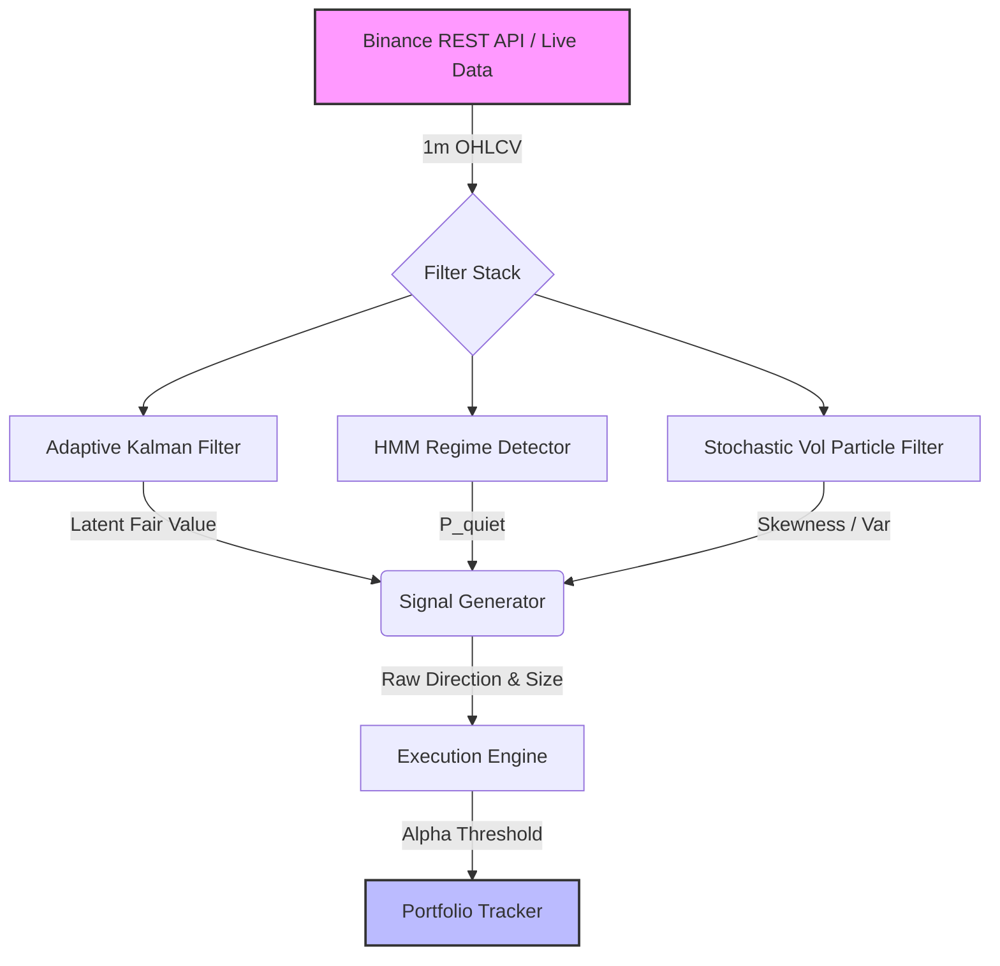

# Algorithmic Trading Filters

A collection of sophisticated algorithmic trading filters and regime-detection models, benchmarked against naive moving averages on synthetic market data, and backtested on live Binance 1-minute crypto data.

## Final System Architecture

## Tier 1 Features
- **Ground-Truth Data Generator (`synthetic.py`)**: Simulates a hidden Ornstein-Uhlenbeck (OU) fair value process with Markov Chain regime switching and fat-tailed noise.
- **Adaptive Kalman Filter (`kalman.py`)**: Estimates latent fair value from noisy price observations. Automatically tunes its $Q$ and $R$ noise matrices online using a recursive EM update (Robbins-Monro stochastic approximation) to adapt to sudden volatility shocks.
- **Hidden Markov Model (`hmm.py`)**: A 2-state unsupervised regime detector. Includes a Baum-Welch EM algorithm for offline parameter calibration and a Forward filter for real-time posterior probability estimation ($P(\text{regime} \mid \text{data})$).
- **Particle Filter (`particle.py`)**: Uses Sequential Importance Resampling (SIR) to maintain 10,000 particles tracking unobservable stochastic log-volatility. Unlike Kalman, this properly isolates skewed, fat-tailed downside risk.

## Capstone Backtest Results (Live BTC Data)

The system was evaluated on ~10,000 live 1-minute BTC/USDT candles. We executed a comparison between a naive taker-fee model (Continuous Bleed) and our execution-optimized limit-order model utilizing an **Alpha Threshold** (Execution Engine).

| Strategy | Sharpe Ratio | Max Drawdown | Hit Rate |
|----------|--------------|--------------|----------|
| **Naive (Taker, Continuous Bleed)** | -354.00 | -64.74% | < 30% |
| **Alpha Threshold (Maker, Limit)** | **+5.01** | **-0.25%** | **59.52%** |

*Note: The naive execution suffers massive fee drag because high-frequency fair-value crossings occur constantly. By enforcing an Alpha Threshold (only trading when `mispricing > cost`), we flip the strategy mathematically positive by utilizing 0 bps Maker execution and severely filtering signal noise.*

## Notebooks & Mathematical Derivations
Please review the Jupyter Notebooks for step-by-step mathematical derivations of the state-space models, E-M update loops, and execution rules:
- `notebook_01_kalman.ipynb`: Kalman Filter derivations and expanding confidence band plots.
- `notebook_02_hmm.ipynb`: Forward-Backward EM derivations and real-time regime detection plots.
- `notebook_04_backtest.ipynb`: Final capstone architecture backtest, live data ingestion, and comparative equity curves.
