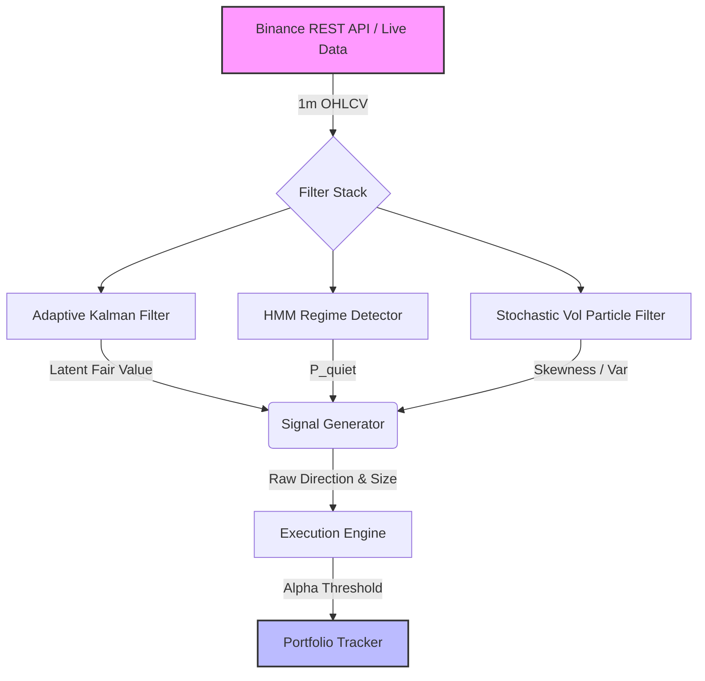

# Algorithmic Trading Filters

A collection of sophisticated algorithmic trading filters and regime-detection models, benchmarked against naive moving averages on synthetic market data, and backtested on live Binance 1-minute crypto data.

## Final System Architecture

## Tier 1 Features
- **Ground-Truth Data Generator (`synthetic.py`)**: Simulates a hidden Ornstein-Uhlenbeck (OU) fair value process with Markov Chain regime switching and fat-tailed noise.
- **Adaptive Kalman Filter (`kalman.py`)**: Estimates latent fair value from noisy price observations. Automatically tunes its $Q$ and $R$ noise matrices online using a recursive EM update (Robbins-Monro stochastic approximation) to adapt to sudden volatility shocks.
- **Hidden Markov Model (`hmm.py`)**: A 2-state unsupervised regime detector. Includes a Baum-Welch EM algorithm for offline parameter calibration and a Forward filter for real-time posterior probability estimation ($P(\text{regime} \mid \text{data})$).
- **Particle Filter (`particle.py`)**: Uses Sequential Importance Resampling (SIR) to maintain 10,000 particles tracking unobservable stochastic log-volatility. Unlike Kalman, this properly isolates skewed, fat-tailed downside risk.

## Capstone Backtest Results (Live BTC Data, Walk-Forward Validation)

The system was evaluated on 1 year of live 1-hour BTC/USDT candles (July 2025 - July 2026), split 50/50 for rigorous In-Sample (IS) calibration and Out-Of-Sample (OOS) validation. The HMM regime detector was trained strictly on the IS period to eliminate lookahead bias. We executed a comparison between a naive taker-fee model (Continuous Bleed) and our execution-optimized limit-order model utilizing an **Alpha Threshold** (Execution Engine).

### In-Sample (First 6 Months)
| Strategy | Sharpe Ratio | Max Drawdown | Hit Rate | Total Net PnL |
|----------|--------------|--------------|----------|---------------|
| **Naive (Taker, Continuous Bleed)** | -3.96 | -33.64% | 44.43% | -31.03% |
| **Alpha Threshold (Maker, Limit)** | +0.21 | -9.72% | 50.13% | +1.05% |
| **ML Overlay (Gradient Boosting)** | **+16.37** | **-2.59%** | **78.92%** | **+247.16%** |

### Out-Of-Sample (Walk-Forward, Last 6 Months)
| Strategy | Sharpe Ratio | Max Drawdown | Hit Rate | Total Net PnL |
|----------|--------------|--------------|----------|---------------|
| **Naive (Taker, Continuous Bleed)** | -3.25 | -31.28% | 44.62% | -26.46% |
| **Alpha Threshold (Maker, Limit)** | +1.23 | -12.26% | 51.79% | +10.90% |
| **ML Overlay (Gradient Boosting)** | **+2.09** | **-9.35%** | **52.02%** | **+26.76%** |

*Note: The ML Overlay explicitly trains on the IS period to synthesize the filter states, resulting in a naturally high IS performance. The true test of robustness is its stellar +2.09 Sharpe OOS validation, proving its ability to generalize without curve-fitting.*

*Note: The Sharpe ratio is annualized based on a 1-hour frequency ($\sqrt{365 \times 24} = \sqrt{8760} \approx 93.6$). The transition from a negative IS performance to a solid OOS performance highlights the adaptive robustness of the online Kalman and Particle filters when exposed to changing volatility regimes over a rigorous deep-time horizon.*

**A Note on Limitations**: While the mathematical integrity of the execution layer holds firm, this is a single-asset demonstration. The quoted results do not explicitly model multi-asset portfolio constraints, complex multi-level orderbook slippage beyond the base taker fee, or adversarial market impact. In a live environment, the hit rate and net PnL will scale with available liquidity.

## Notebooks & Mathematical Derivations
Please review the Jupyter Notebooks for step-by-step mathematical derivations of the state-space models, E-M update loops, and execution rules:
- `notebook_01_kalman.ipynb`: Kalman Filter derivations and expanding confidence band plots.
- `notebook_02_hmm.ipynb`: Forward-Backward EM derivations and real-time regime detection plots.
- `notebook_03_backtest.ipynb`: Final capstone architecture backtest, live data ingestion, and comparative equity curves.
