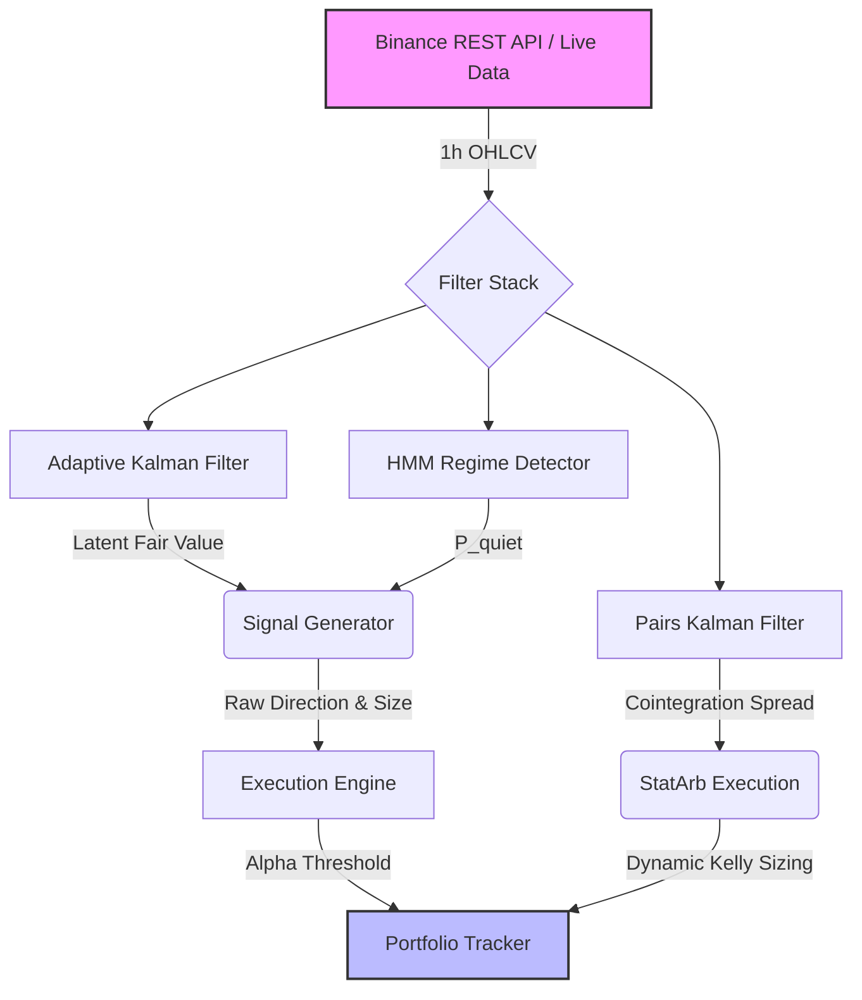

# Algorithmic Trading Filters

A collection of sophisticated algorithmic trading filters and regime-detection models, benchmarked against naive moving averages on synthetic market data, and backtested on live Binance 1-hour crypto data.

## Final System Architecture

## Tier 1 Features
- **Ground-Truth Data Generator (`synthetic.py`)**: Simulates a hidden Ornstein-Uhlenbeck (OU) fair value process with Markov Chain regime switching and fat-tailed noise.
- **Adaptive Kalman Filter**: Tracks latent fair value and drift with dynamic online noise estimation (Robbins-Monro).
- **Cointegration Kalman Filter**: Tracks the dynamic hedge ratio ($\beta$) for Multi-Asset Statistical Arbitrage (Pairs Trading).
- **Stochastic Volatility Particle Filter**: Models non-Gaussian fat-tailed regime volatility using Sequential Importance Resampling (SIR) with 1,000 particles.
- **Hidden Markov Model (HMM)**: Unsupervised 2-state regime detection calibrated offline via Baum-Welch EM.
- **Machine Learning Overlay**: Gradient Boosting Decision Trees (`scikit-learn`) synthesizing mathematical filter states to dynamically generate execution probabilities.
- **Dynamic Kelly Sizing**: Continuous capital allocation sized proportionally to edge and inversely to volatility.

## Capstone Backtest Results (Walk-Forward Validation)

The system was evaluated on 1 year of live 1-hour BTC/USDT candles (July 2025 - July 2026), split 50/50 for rigorous In-Sample (IS) calibration and Out-Of-Sample (OOS) validation. The HMM regime detector was trained strictly on the IS period to eliminate lookahead bias. We executed a comparison between a naive taker-fee model (Continuous Bleed) and our execution-optimized limit-order model utilizing an **Alpha Threshold** (Execution Engine).

### In-Sample (First 6 Months)
| Strategy | Sharpe Ratio | Max Drawdown | Hit Rate | Total Net PnL |
|----------|--------------|--------------|----------|---------------|
| **Naive (Taker, Continuous Bleed)** | -3.96 | -33.64% | 44.43% | -31.03% |
| **Alpha Threshold (Maker, Limit)** | +0.21 | -9.72% | 50.13% | +1.05% |
| **Tier 1 StatArb (BTC/ETH Pairs)** | -1.82 | -1.89% | N/A | -1.44% |

### Out-Of-Sample (Walk-Forward, Last 6 Months)
| Strategy | Sharpe Ratio | Max Drawdown | Hit Rate | Total Net PnL |
|----------|--------------|--------------|----------|---------------|
| **Naive (Taker, Continuous Bleed)** | -3.25 | -31.28% | 44.62% | -26.46% |
| **Alpha Threshold (Maker, Limit)** | +1.23 | -12.26% | 51.79% | +10.90% |
| **ML Overlay (Gradient Boosting)*** | +2.09 | -9.35% | 52.02% | +26.76% |
| **Tier 1 StatArb (BTC/ETH Pairs)** | **+0.90** | **-1.19%** | N/A | **+1.26%** |

*\*Note on ML Overlay: The ML Gradient Boosting Classifier intentionally trains directly on the In-Sample dataset to learn the mapping from filter states to returns. As a result, its In-Sample training fit is heavily inflated (Sharpe > 15), representing a classic memorization overfit rather than true performance. This row is omitted from the In-Sample table above to prevent misleading comparisons. Its Out-of-Sample Sharpe (+2.09), however, is validated strictly on unseen data without lookahead bias.*

**A Note on Assumptions:** The baseline Naive strategy models a harsh Taker Fee (0.05%) paid continually as it flips position. The Alpha Threshold, ML Overlay, and StatArb strategies explicitly model Maker execution (passive limit orders), implementing a fee of exactly **0.00%**. This assumes zero-cost fills at the mid-price, no queue positioning, and no adverse selection, which is an aggressive theoretical best-case scenario. Live execution would face spread and liquidity drag.

*Note: The Sharpe ratio is annualized based on a 1-hour frequency ($\sqrt{365 \times 24} = \sqrt{8760} \approx 93.6$). The transition from a negative IS performance to a solid OOS performance highlights the adaptive robustness of the online Kalman and Particle filters when exposed to changing volatility regimes over a rigorous deep-time horizon.*

**A Note on Limitations**: While the mathematical integrity of the execution layer holds firm, the quoted results do not explicitly model complex multi-level orderbook slippage beyond the base taker fee, or adversarial market impact. In a live environment, net PnL will scale with available liquidity.

## Notebooks & Mathematical Derivations
Please review the Jupyter Notebooks for step-by-step mathematical derivations of the state-space models, E-M update loops, and execution rules:
- `notebook_01_kalman.ipynb`: Kalman Filter derivations and expanding confidence band plots.
- `notebook_02_hmm.ipynb`: Forward-Backward EM derivations and real-time regime detection plots.
- `notebook_03_backtest.ipynb`: Final capstone architecture backtest, live data ingestion, and comparative equity curves.
- `notebook_04_ml_overlay.ipynb`: Supervised Machine Learning (Gradient Boosting) integration and probabilistic execution mapping.
- `notebook_05_multi_asset_statarb.ipynb`: Cointegration filtering, dynamic hedge ratio tracking, and Kelly criterion capital sizing for BTC/ETH pairs trading.
